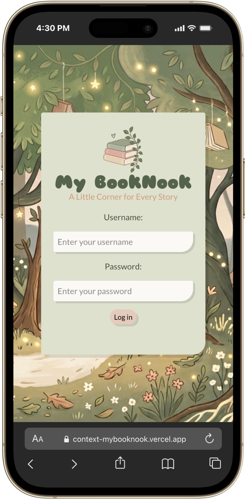
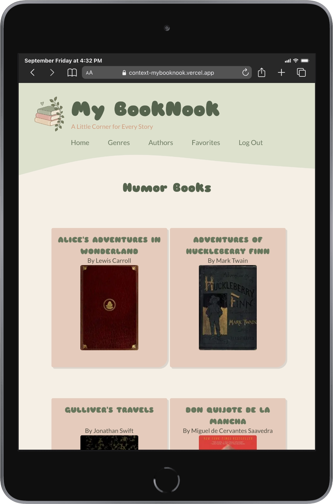
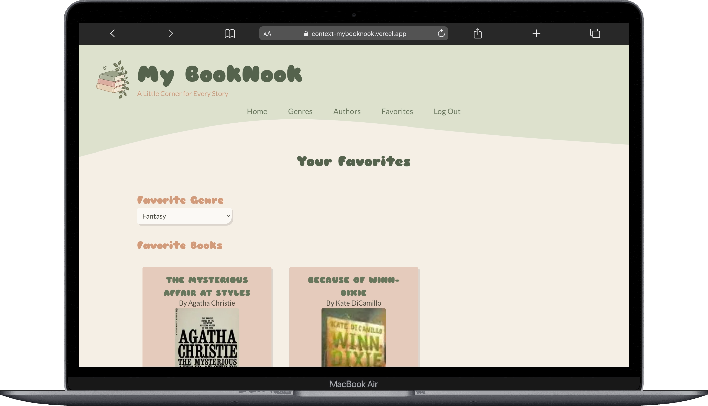

# 📚 My BookNook - A Little Corner for Every Story

### 🪩 Live Site: https://context-mybooknook.vercel.app/
**(Test username: jane, password: austin)**

<p align="center">
  
  
  <br/>
</p>

A responsive book discovery and book logging application built with Next.js, TypeScript, the OpenLibrary API, and local storage.  

The application allows usuers to explore books and authors, and save favorite books and favorite genre. User-specific informations is managed through Context, allowing different users to see different content. Local storage in the browser is used to persist relevant user data and allows the user to see saved information available when they return to the application on the same browser.

## ✨ Features

### 🔐 Authentication  
- Users can log in with a username and password to go to home page
- The logged-in user remains logged in while navigating between routes
- Local storage keeps user logged in on refresh
- The user can log out
- A different user can log in in the same session  

### 🏠 Home Page
 
- If the user is not logged in, a login form is displayed
- If the user is logged in, a header with navigation and a book suggestion is displayed

The home page displays a randomly selected book based on the user's set favorite genre. If the user has not a set favorite genre, a random book from a random genre is selected.

### 📖 Genres Page
- Available genres are displayed
- Clicking on a category navigates the user to the genre page
- The genre page displays a maximum of 12 books from that genre
- Clicking on a book card navigates the user to the book page where more detailed information about the book is displayed
  - On the detailed book page, the user can favorite a book

### ✍️ Authors Page
- Authors from the user's set favorite genre are displayed
  - If the user has not set a favorite genre, a random author from a random genre will be displayed
- Clicking on an author card navigates the user to the author page where more detailed information about the author is displayed

### ❤️ Favorites Page
- A dropdown is displayed where the user can set a favorite genre
- If the user has favorited books, they are displayed

## 🕸 Context
The application uses Context to manage the currently logged-in user and make their information available throught the application without having to pass it through multiple layers of props.

The UserContext stores a UserType object, or null when no user is logged in.  
The UserType contains the user's:
- username
- password
- favorite genre
- favorited books

This allows different parts of the application to react to changes in the user's state. For example, when the user saves a book from the Genre page, the Favorite page will update favorited books through the same context.  

This also allows different users to see different content. Since each user has their own context, the content displayed on the pages will be different.

## 🔀 Dynamic Routing
The application uses Next.js's built-in file-based routing system for navigation between pages. Dynamic routes are used for the individual book and author pages. Instead of creating a separate page for every book or author, the application uses a dynamic route with the book's/author's ID.

For example, the book page is structured using a dynamic route such as:

```text
app/
└── book/
    └── [id]/
        └── page.tsx
```

The [id] segment allows the same page template to display different books depending on the ID in the URL. When a user clicks on a book, its ID is passed through the URL. The dynamic page then uses this ID to fetch the corresponding book information from the OpenLibrary API. This allows the application to reuse the same page for every book while dynamically displaying the appropriate information for each one.

## ⚙️ Technologies
- Next.js
- TypeScript
- Tailwind CSS
- OpenLibrary API
- FontAwesome Icon Library

## 🧐 To view locally
```bash
git clone https://github.com/claudiacarion/context-mybooknook.git
cd context-mybooknook
npm install
npm run dev
```

## Grateful for any feedback or suggestions! Thank you! 🙏